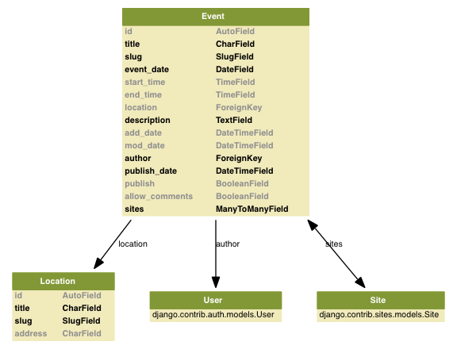

=============
django-agenda
=============

What is it?
===========
The django-agenda app is a generic
implementation of a web-based calendar
with events.

Status
======
Django-agenda is currently stable enough for beta testing.
As much as I would love people using it right now, I have not
taken it into production myself and therefore would not swear
over its stability.

Feautures
=========
Current
---------
- Full post-1.0 support, currently used on Django trunk.
- Kind admin interface with automatic author assignment (Django User).
- More elegant date_based generic view implementation. Finally you get all the info a decent archive will require. 
- Demo project with very basic templates.
- Event archive.
- Browseable calendar based on Python's calendar module.
- django.contrib.comments support
- django.contrib.sites support (with default value in admin)
- Event and comment feeds.
- Sitemaps.
- Fully localizable; all strings are translatable.
- vCard iCalendar export, timezone aware and all!

Future
------
- User RSVP
- Event subscriptions / reminder e-mails (django-notify?)
- User contributed events.
- Repeated events

Models
======

Requirements
============
All requirements are currently included in the "deps" directory.
- django-logging
- vobject

License
=======
The django-agenda app is released 
under the GPL version 3.
